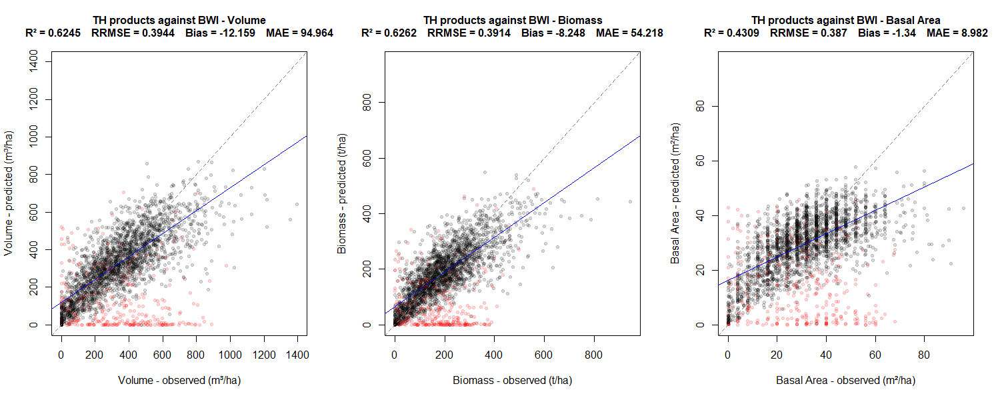
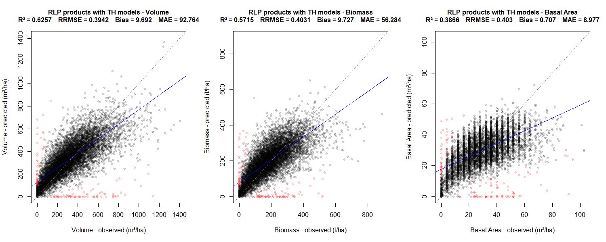

## Waldstruktur - Bedeckungsgrad

Dieser Layer gehört zur Gruppe der Waldstruktur-Produkte, die auf Basis von flugzeuggestütztem Laserscanning (Lidar) erstellt werden. Da die Daten der deutschlandweiten Lidar-Kampagne (noch) nicht vorliegen, wurden diese Produkte auf Basis der Daten aus Thüringen erstellt, und sind bisher auf Thüringen beschränkt.

*Wie wird das Produkt berechnet?*

Dieser Layer beschreibt den Anteil des Pixels, der von Baumkronen oder anderer Vegetation mit Höhe über 2 m überschirmt ist.

Zuerst wurde ein Bestandeshöhenmodell (canopy height model, CHM) berechnet. Dies ist ein Raster mit der Auflösung 50 cm, das den höchsten Punkt der Lidar-Punktwolke in jeder Rasterzelle ermittelt. Dabei wird eine Ausleuchtungsbreite des Laserstrahls mit einem Radius von 25 cm unterstellt. Der Bedeckungsgrad wird dann berechnet als der Anteil der 50 cm-Rasterzellen, deren Wert 2 m übersteigt.

## Waldstruktur – Bestandesoberhöhe

Dieser Layer gehört zur Gruppe der Waldstruktur-Produkte, die auf Basis von flugzeuggestütztem Laserscanning (Lidar) erstellt werden. Da die Daten der deutschlandweiten Lidar-Kampagne (noch) nicht vorliegen, wurden diese Produkte auf Basis der Daten aus Thüringen erstellt, und sind bisher auf Thüringen beschränkt.

*Wie wird das Produkt berechnet?*

Für jedes 10x10m Pixel wird aus den Höhen aller Punkte der Lidar-Punktwolke das 95. Perzentil berechnet. 

*Was bedeutet das?*

Dieser Höhenwert ist stark korreliert mit im Wald gemessenen Höhenmetriken wie H100. Durch die Wahl des 95. Perzentils wird verhindert, dass eventuelle Störsignale in der Punktwolke die Metrik stark beeinflussen.

Die Einheit ist Meter (m).

## Waldstruktur - Vertical Complexity Index (Bestandesschichtung)

Dieser Layer gehört zur Gruppe der Waldstruktur-Produkte, die auf Basis von flugzeuggestütztem Laserscanning (Lidar) erstellt werden. Da die Daten der deutschlandweiten Lidar-Kampagne (noch) nicht vorliegen, wurden diese Produkte auf Basis der Daten aus Thüringen erstellt, und sind bisher auf Thüringen beschränkt.

*Wie wird das Produkt berechnet?*

Der Index der vertikalen Komplexität (Vertical Complexity Index, VCI) ist ein Maß für die Gleichmäßigkeit der vertikalen Verteilung der Punkte. Er wird berechnet als Shannon-Wiener-Index über 60 Höhenklassen von je einem Meter:

$$VCI = \frac{-\sum_{i=1}^{n} p_i \ln(p_i)}{\ln(n)}$$

wobei $p_i$ der relative Anteil der Punkte mit einer Höhe zwischen $i-1$ und $i$ Metern ist, und $n = 60$.

*Was bedeutet das?*

Ein VCI nahe 1 bedeutet, dass die Punkte gleichmäßig über alle Höhenschichten verteilt sind, während ein VCI nahe 0 bedeutet, dass sich alle Punkte auf eine oder wenige Höhenschichten konzentrieren. In der Praxis kann ein hoher VCI sowohl auf eine höhere Gesamthöhe des Bestandes hindeuten, als auch auf eine komplexere Bestandesschichtung z.B. aus Unterstand und Oberstand.

## Waldstruktur – Volumen (Bestandesvorrat)

Dieser Layer gehört zur Gruppe der Waldstruktur-Produkte, die auf Basis von flugzeuggestütztem Laserscanning (Lidar) erstellt werden. Da die Daten der deutschlandweiten Lidar-Kampagne (noch) nicht vorliegen, wurden diese Produkte auf Basis der Daten aus Thüringen erstellt, und sind bisher auf Thüringen beschränkt.

*Wie wird das Produkt berechnet?*

Der Bestandesvorrat ist das Volumen der Stämme lebender Bäume, auf einen Hektar hochgerechnet. Er wird berechnet mittels des flächenbasierten Ansatzes auf 10m-Pixeln durch eine nichtlineare Regression der Form

$$V = a \cdot h ^b \cdot \rho^c$$

wobei $h$ die mittlere Höhe eines Bestandeshöhenmodells (CHM) ist, $\rho$ das abundanzgewichtete Mittel der trockenen Holzdichten der vorkommenden Baumarten, und $a$, $b$ und $c$ die Regressionskoeffizienten.

Mit Daten der Bundeswaldinventur (BWI) wurde die Modellparameter wie folgt kalibriert:

$$a = 3.4838,    b = 1.3921,    c = -0.76431$$

Die Einheit ist Festmeter pro Hektar (m³/ha).

## Waldstruktur – Biomasse 

Dieser Layer gehört zur Gruppe der Waldstruktur-Produkte, die auf Basis von flugzeuggestütztem Laserscanning (Lidar) erstellt werden. Da die Daten der deutschlandweiten Lidar-Kampagne (noch) nicht vorliegen, wurden diese Produkte auf Basis der Daten aus Thüringen erstellt, und sind bisher auf Thüringen beschränkt.

*Wie wird das Produkt berechnet?*

Es handelt sich um die lebende oberirdische Biomasse, auf einen Hektar hochgerechnet. Sie wird berechnet mittels des flächenbasierten Ansatzes auf 10m-Pixeln durch eine nichtlineare Regression der Form

$$B = a \cdot h ^b \cdot \rho^c$$

wobei $h$ die mittlere Höhe eines Bestandeshöhenmodells (CHM) ist, $\rho$ das abundanzgewichtete Mittel der trockenen Holzdichten der vorkommenden Baumarten, und $a$, $b$ und $c$ die Regressionskoeffizienten.

Mit Daten der Bundeswaldinventur (BWI) wurde die Modellparameter wie folgt kalibriert:

$$ a = 4.988,    b = 1.343,    c = 0.3047$$

Die Einheit ist Tonne pro Hektar (t/ha).

## Waldstruktur – Bestandesgrundfläche

Dieser Layer gehört zur Gruppe der Waldstruktur-Produkte, die auf Basis von flugzeuggestütztem Laserscanning (Lidar) erstellt werden. Da die Daten der deutschlandweiten Lidar-Kampagne (noch) nicht vorliegen, wurden diese Produkte auf Basis der Daten aus Thüringen erstellt, und sind bisher auf Thüringen beschränkt.

*Wie wird das Produkt berechnet?*

Die Bestandesgrundfläche ist die Querschnittsfläche der Stämme aller Bäume in Brusthöhe (1,3 m), auf einen Hektar hochgerechnet. Sie wird berechnet mittels des flächenbasierten Ansatzes auf 10m-Pixeln durch eine nichtlineare Regression der Form

$$A = a \cdot h ^b \cdot \rho^c$$

wobei $h$ die mittlere Höhe eines Bestandeshöhenmodells (CHM) ist, $\rho$ das abundanzgewichtete Mittel der trockenen Holzdichten der vorkommenden Baumarten, und $a$, $b$ und $c$ die Regressionskoeffizienten.

Mit Daten der Bundeswaldinventur (BWI) wurde die Modellparameter wie folgt kalibriert:

$$a = 2.1713, b = 0.75521, c = -0.71128$$

Die Einheit ist Quadratmeter pro Hektar (m²/ha).

## Zur Genauigkeit der modellierten Variablen

Der vergleich der modellierten Variablen (Volumen, Biomasse, Bestandesgrundfläche) aus dem Produkt mit den Daten der Bundeswaldinventur zeigt, dass die modellierten Werte für Volumen und Biomasse mit weniger Unsicherheit behaftet sind als für Bestandesgrundlächen.
In den untenstehenden Grafiken werden für Thüringen (TH) und Rheinland-Pfalz (RLP) der jeweilige Vergleich dargestellt, und einige Kennzahlen angegenben, darunter
das Bestimmtheitsmaß (R²) einer linearen Regression (blaue linie), die mit dem Mittelwert normalisierte Wurzel aus dem mittleren quadratischen Fehler (relative root mean squared error, RRMSE), den Schätzfehler (Bias), und den mittleren Betrag des Fehlers (mean absolute error, MAE). 
Rot dargestellte Punkte wurden nicht berücksichtigt, aufgrund der Diskrepanz zwischen BWI-Aufnahme und Lidar-Daten, welche in der Regel dadurch entsteht, dass zwischen BWI-Aufnahme und Lidar-Aufnahme Zeit verstrichen ist, in welcher eine Störung des Bestandes auftrat.

 

 
